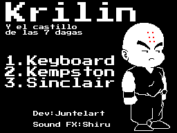
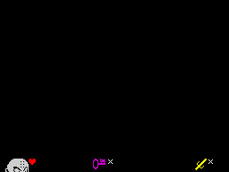
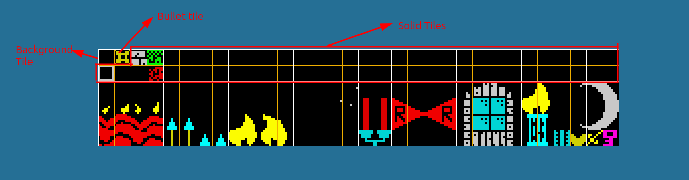
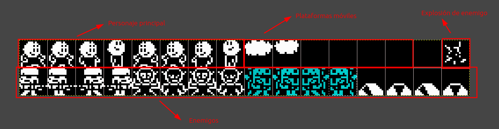

# Diseñando

Para crear tu juegos para ZX Spectrum necesitas crear/editar algunas imágenes.

**Pantallas** coomo la principal, de carga, HUD... Y el **Tileset** o conjunto de tiles que usarás para diseñar tu mapa y el **Spriteset** o conjunto de sprites como el personaje principal, enemigos...

## Pantallas

Tienes que crear 4 pantallas en PNG en la carpeta assets/screens loading.png, title.png, ending.png y hud.png

Para el diseño de las mismas sólo podéis utilizar la paleta de colores del spectrum, si usáis programas especialiados como [ZX Paintbrush](https://sourcesolutions.itch.io/zx-paintbrush) ya lo tienen en cuenta.

Tenéis ejemplos en la misma carpeta para simplemente modificar las pantallas existentes y ver que requisitos tienen (tamaño...)

### Carga

Esta imagen (assets/screens/loading.png) será usada en la pantalla de carga. Es la que se muestra mientras tu juego está cargando.

### Pantalla principal

Esta imagen (assets/screens/title.png) es la que se muestra nada más cargar el juego y que debe contener las opciones que puede seleccionar el usuario.

### Ending

Esta imagen (assets/screens/ending.png) se mostrará cuando el usuario se pase el juego.

### HUD

Esta imagen (assets/screens/hud.png) se mostrará debajo de tu juego para indicarle al usuario cuanta vida le queda y cuantas llaves e items ha recolectado.

Tiene el mismo tamaño que las anteriores pero solo necestas diseñar la parte de abajo.

### Tile Set

Tienes que crear (o editar) una imágen de 256x48px (assets/tiles.png) que se usará para diseñar tus pantallas.

ZX Game Maker trabaja con tiles de 8x8px, en consecuencia tienes disponibles 256 tiles para diseñar tus escenarios.

Para crear tu tielset debes tener en cuenta algunas regla, recuerda que tienes uno de ejemplo para simplemente editarlo.

* El **primer tile** está reservado para el **fondo**.
* El **segundo tile** está reservado para **"la bala"** que disparará tu protagonista.
* Los **siguientes 62 tiles** serán considerados como **sólidos**, es decir, cuando lo coloques en tu mapa, el protagonista no podrá traspasarlos, son los típicos que se usan para paredes, plataformas...

#### Sprites

Debes crear/editar el fichero assets/sprites.png de 256x32px añadiendo tus sprites (personaje, enemigos...) y donde cada uno de estos tendrá una dimensión de 16x16px.

Los primeros 8 sprites están reservados para la animáción del protragonista, los 3 primeros para el movimiento hacia la derecha, el 4º para el salto hacia la derecha, los 3 siguientes para el movimiento hacia la izquierda, y por último, el 8º para el salto hacia la izquierda.

Los siguientes 6 sprites (9 - 14) se usarán para las plataformas en movimiento encima de las cuales el protagonista podrá saltar. 3 plataformas con 2 sprites de animación para cada una.

El siguiente sprite no se puede usar. No pasa nada si deseñas algo en el.

El siguiente sprite se usará para mostrar la explosión del enemigo cuando lo mates.

Los 16 tiles restantes se usarán para los enemigos, 4 para cada enemigo, 2 frames de animación para cada sentido, es decir, podrás definir un total de 4 enemigos.

