# Diseñando tus pantallas y posicionando los elementos con Tiled

Tiled es una muy buena herramienta para diseñar tus pantallas. Usando Tiled puedes crear el mapa del juego y posicionar elementos como los enemigos, llaves, items a recolectar, puertas...

Nuestro juego, aunque es configurable, por defecto tendrá un tamaño de 32x22 tiles.

## Crear el mapa

Cuando crees en mapa tienes que seleccionar las siguientes propiedades:

* Orientation: Orthogonal.
* Tile layer format: CSV.
* Tile render order: Right Down.
* Map size: Infinite.
* Tile size: 8x8px.

Después ves al menu Map > Properties y marca el mapa como **infinito** y Output Chunk Width a 32 y Output Chunk Height a 22

## Preferencias

Para poder distinguir bien los tiles y la división entre pantallas ves al menú Preferences > Interface y introduce en Major grid 32 tiles x 22 tiles.

## Crear tilesets

Es la hora de añadir a nuestro programa de diseño Tiled el tileset y el spriteset para poder utilizarlo en el mismo y diseñar nuestras pantallas.

Tienes que crear 2 tilesets, uno para **tiles** importando la imagen assets/tiles.png de 8x8px y otro para **spriteset** de 16x16px importando assets/sprites.png

Es importante seleccionar **Object Aligment** **Top Left** en las propiedades de los dos tilesets.

## Crear capas

Necesitamos 2 capas, una para pintar nuestro escenario y otra para situar los elementos como enemigos en el mismo.

## Uso básico de Tiled

Usar Tiled es muy sencillo e intuitivo y tienes una documentación muy completa sobre ello [https://doc.mapeditor.org/en/stable/](https://doc.mapeditor.org/en/stable/). Aún así os dejamos unos tips muy básicos:

Para pintar tiles en el mapa es necesitas tener la capa map seleccionada y después seleccionar alguna herramienta de inserción como la brocha de estampar o la herramienta de rellenado.

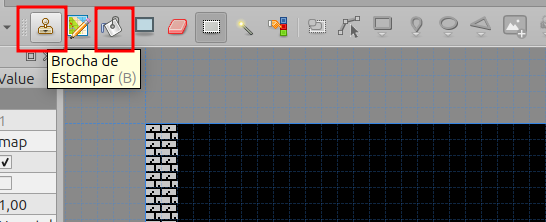

Para añadir los enemigo, los puntos como de fin de trayecto del mismo (movimiento) o de inicio del protagonista, deberás tener la capa objects seleccionada y usar una de las herramientas de añadir.

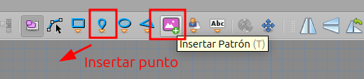

## Consideraciones generales

### Filas uniformes

Los mapas tiene que tener todas las filas con el mismo número de columnas, por ejemplo, si nuestro mapa tiene 2 "pisos" y en la planta baja hay 5 habitaciones, todos los pisos deben de tener 5 habitaciones. Si no puede acceder el usuario no pasa nada, las rellenas con el primer tile (fondo) y ya está.

Ejemplo com filas distintas (incorrecto):

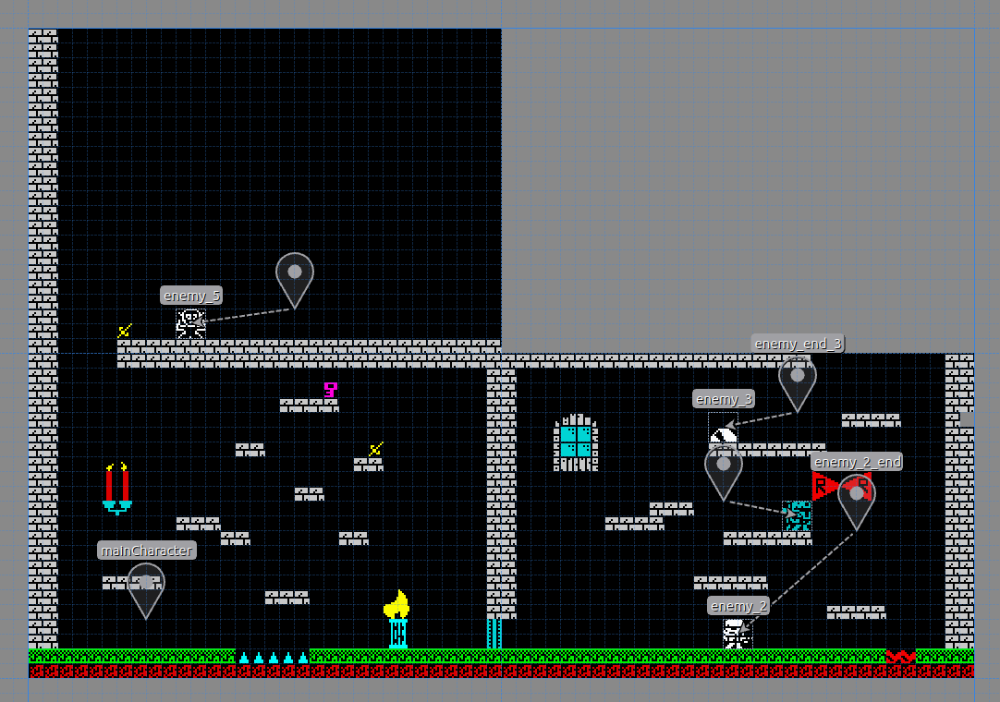

El mismo ejemplo con filas uniformes, todas las filas tienen las mismas "habitaciones"

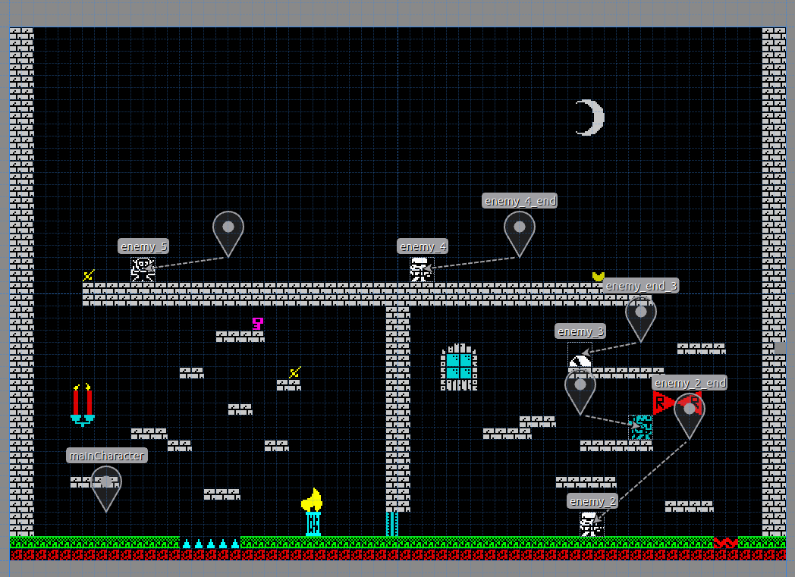

### Habitaciones completas

Las habitaciones tiene que estar completas, no se pueden diseñar habitaciones que les falten tiles o por ejemplo 2 habitaciones y media.

## Añadiendo elementos

### Enemigo

Puedes añadir hasta 3 enemigos en cada pantalla y configurar su movimiento.

#### Posición inicial

Para ello deberás seleccionar la capa objects y arrastrar el 1er sprite del enemigo a posicionar donde quieras que aparezca inicialmente.

Como truco, si pulsas la tecla Ctrl el enemigo se situará respetado la rejilla.
You can add enemies into your map and set its movement (just horizontal for now). Set enemy in Type into object properties

En la propiedad **type** de este objeto deberás introducir el text **enemy**

Es recomendable que le pongas un nombre al mismo para cuando referencies la posición final a este. E.g. enemy_1

#### Posición final

* Haz clic en el botón **Insert point**.
* Pon este punto donde quieras que para el enemigo manteniendo la tecla Ctrl.
* Añade a este punto una **propiedad personalizada** (custom property) **de tipo objeto** y selecciona el enemigo relacionado con este punto.

#### Tipos de movimiento

El enemigo permite 3 tipos de movimiento:
* **Horizontal**, el enemigo y su trayecto están a la misma altura, es decir, la y del enemigo y del punto de destino son iguales y las x distintas.

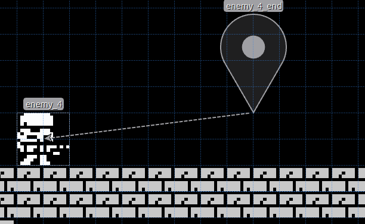

* **Vertical**, el enemigo y su trayecto están en la misma vertical, es decir, la x del enemigo x del punto de destino son iguales y las y distintas.

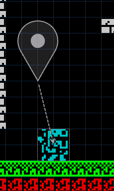

* **Diagonal**, el enemigo y el punto final no están a la misma altura ni en la misma vertical, es decir, ni la x del enemigo ni la y coinciden con la del punto de destino.

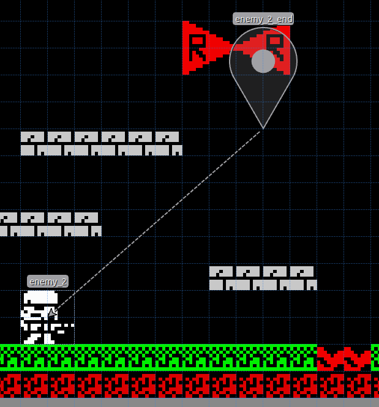

#### Cantidad de vida

Puedes asignarle la cantidad de vida que tiene cada enemigo, por ejemplo si le pones cantidad de vida 5 el protagonista le tendrá que disparar 5 veces para matarlo.

Para ello solo tienes que añadir una propiedad personalizada **life** **de tipo int** con el valor de la vida. Si no la defines, por defecto, el enemigo tiene una unidad de vida.

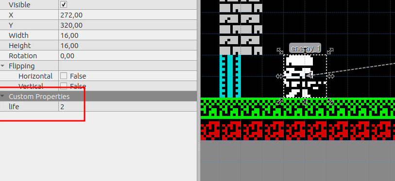

### Item

Este es el objeto que el protagonista deberá ir recogiendo por todo el juego para finalizar el mismo (Es configurable)

Tienes que seleccionar el tile que quieras usar para este fin, por ejemplo en el juego de Krilin la daga, y poner que el tipo de el mismo es **item**

Para ello haz clic en la rueda dentada de propiedades del tileset, selecciona el tile que desees (la daga por ejemplo) y escribe **item** en la casilla type.

### Door

Este tile será considerado solido para el protagonista. deberás tener al menos una **key** para abrir la puerta y cuando lo hagas se te restará de tu inventario.

Para setear un tile de este tipo haz clic en la rueda dentada de propiedades del tileset, selecciona el tile que desees y escribe **door** en la casilla type.

Después ya puedes añadirlo a tu mapa arrastrándolo.

### Key

Como habrás podido ver en el párrafo anterior, necesitas el objeto **key** para abrir las puertas.

Para setear un tile de este tipo haz clic en la rueda dentada de propiedades del tileset, selecciona el tile que desees y escribe **key** en la casilla type.

Después ya puedes añadirlo a tu mapa arrastrándolo.

### Life item

Este objeto permitirá al personaje restablecer una cantidad de visa (configurable).

Para setear un tile de este tipo haz clic en la rueda dentada de propiedades del tileset, selecciona el tile que desees y escribe **life** en la casilla type.

Después ya puedes añadirlo a tu mapa arrastrándolo.

### Tile de daño

Este tipo de tile dañará al personaje principal cuando lo toque y este saldrá rebotado.

Para setear un tile de este tipo haz clic en la rueda dentada de propiedades del tileset, selecciona el tile que desees y escribe **damage** en la casilla type.

**Importante** solo puedes marcar tiles de daño **tiles sólidos**, es decir, que estén el las 2 primeras filas del tileset.

### Tiles animados

En ocasiones le da un aspecto más agradable que los escenarios tengan ciertos tiles animados, por ejemplo, unas velas a las que se le mueven las llamas.

Para ello deberás tener preparado tu tileset con el tile que tengas pensado animar y justamente el siguiente tile sea el frame al que se intercambiará para simular el movimiento.

Para setear un tile de este tipo haz clic en la rueda dentada de propiedades del tileset, selecciona el tile que desees y escribe **animated** en la casilla type.

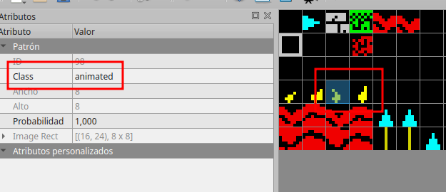

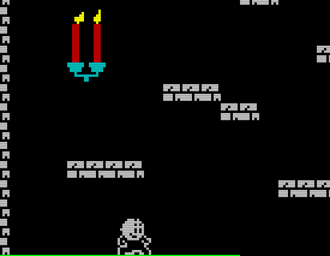

### Tiles de daño animados

A veces es interesante setear un tile con las dos propiedades anteriores, que hagan daño y que sean animados, por ejemplo una lava que tiene que dañar al protagonista y se tiene que mover. En este caso la el tipo o class (en las nievas versiones le han llamado class) ha de ser **animated-damage**

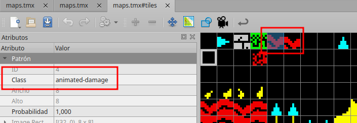

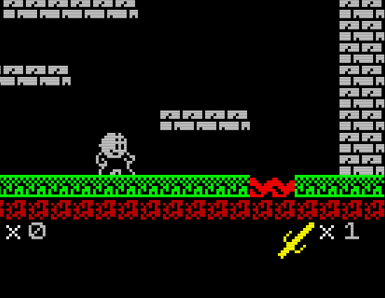

## Configuración general

Puedes añadir configuraciones generales de tu juego en las propiedades personalizadas el mapa.

Propiedades personalizadas:

* **bulletDistance**. Distancia que queramos que recorra la bala. Si seteamos una distancia corta como de 2, da el efecto de que el personaje ataca con el arma a corta distancia como una espada.
* **damageAmount**. Cuanto daño le hacen al personaje los enemigos.
* **enemiesRespawn**. Con esto seteamos si queremos que los enemigos vuelvan a aparecer, aunque los hayamos matado, cuando volvemos a la habitación.
* **goalItems**. Número de items necesarios para finalizar el juego.
* **initialLife**. Cantidad de vida inicial del personaje.
* **lifeAmount**. Cantidad de vide que incrementa al personaje los items **life**.
* **shooting**. Con esto habilitamos o deshabilitamos el disparo del personaje.
* **shouldKillEnemies**. Con esta propiedad activa, si una habitación tiene enemigos, no podremos salir de ella hasta que los matemos a todos.

