# Diseñando tus pantallas y posicionando los elementos con Tiled

Tiled es una muy buena herramienta para diseñar tus pantallas. Usando Tiled puedes crear el mapa del juego y posicionar elementos como los enemigos, llaves, items a recolectar, puertas...

Nuestro juego, aunque es configurable, por defecto tendrá un tamaño de 32x22 tiles.

## Creat el mapa

Cuando crees en mapa tienes que eleccionar las siguientes propiedades:

* Orientation: Orthogonal.
* Tile layer format: CSV.
* Tile render order: Right Down.
* Map size: Infinite.
* Tile size: 8x8px.

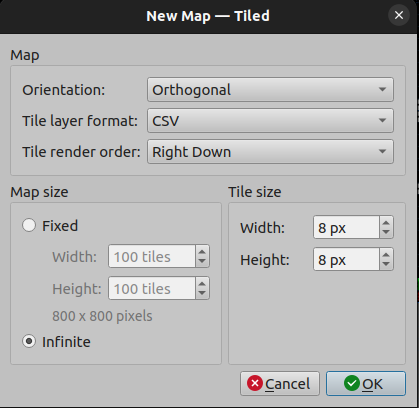

Después ves al menu Map > Properties y marca el mapa como **infinito** y Output Chunk Width a 32 y Output Chunk Height a 22

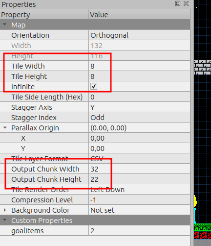

## Preferencias

Para poder distinguir bien los tiles y la división entre pantallas ves al menú Preferences > Interface y introduce en Major grid 32 tiles x 22 tiles.

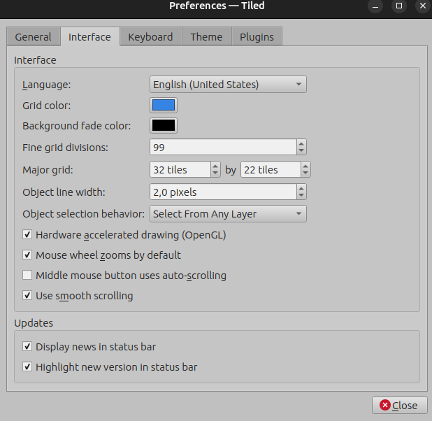

## Crear tilesets

Es la hora de añadir a nuestro programa de diseño Tiled el tilesed y el spriteset para poder utilizarlo en el mismo y diseñar nuestras pantallas.

Tienes que crear 2 tilesets, uno para **tiles** importando la imágen assets/tiles.png de 8x8px y otro para **spriteset** de 16x16px importando assets/sprites.png

Es importante seleccionar **Object Aligment** **Top Left** en las propiedades de los dos tilesets.

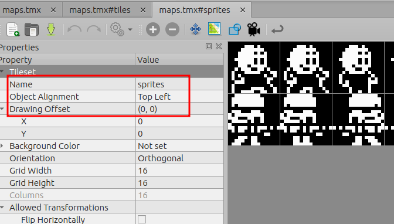
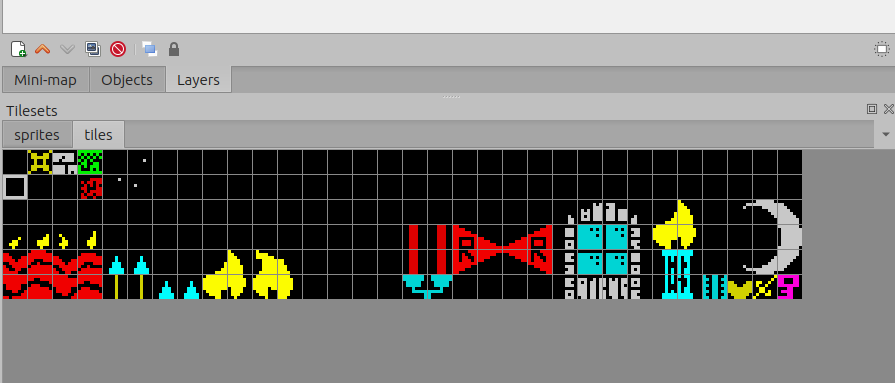
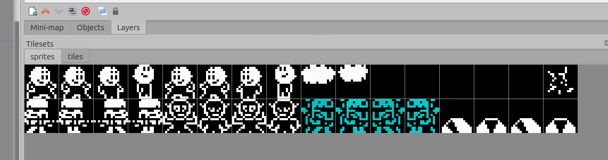

## Crear capas

Necesitamos 2 capas, una para pintar nuestro escenario y otra para situar los elementos como enemigos en el mismo.

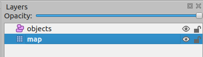

## Añadiendo elementos

### Enemigo

Puedes añadir hasta 3 (de momento) enemigos en cada pantalla y configurar su movimiento (de momento sólo horizontal).

#### Posición inicial

Para ello deberás seleccionar la capa objects y arrastrar el 1er sprite del enemigo a posicionar donde quieras que aparezca inicialmente.

Como truco, si pulsas la tecla Ctrl el enemigo se situará respetado la rejilla.
You can add enemies into your map and set its movement (just horizontal for now). Set enemy in Type into object properties

En la propiedad **type** de este objeto deberás introducir el text **enemy**

Es recomendable que le pongas un nombre al mismo para cuando referencies la posición final a este. E.g. enemy_1

#### Posición final

* Haz clic en el butón **Insert point**.
* Pon este punto donde quieras que para el enemigo manteniendo la tecla Ctrl y a la misma altura(Coordenada Y) que el enemigo.
* Añade a este punto una propiedad personalizada (custom property) de tupi objeto y selecciona el enemigo relacionado con este punto.

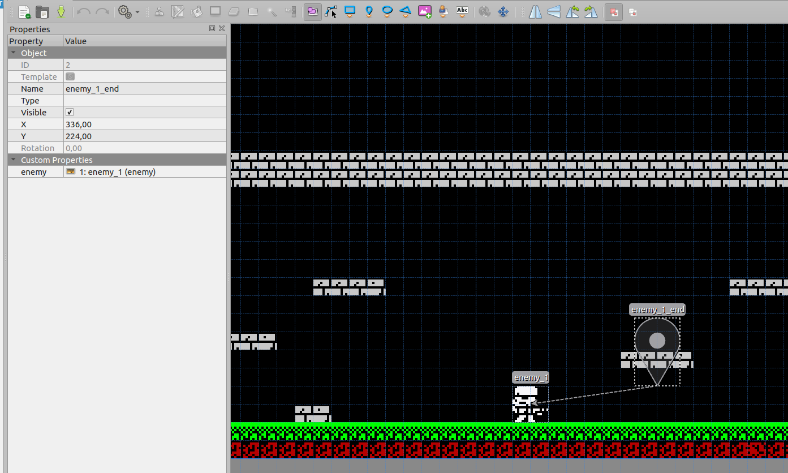

### Item

Este es el objeto que el protagonista deberá ir recogiendo por todo el juego para finalizar el mismo (Es configurable)

Tienes que seleccionar el tile que quieras usar para este fin, por ejemplo en el juego de Krilin la daga, y poner que el tipo de el mismo es **item**

Para ello haz clic en la rueda dentada de propiedades del tileset, selecciona el tile que desees (la daga por ejemplo) y escribe **item** en la casilla type.

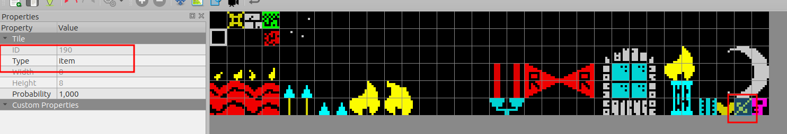

### Door

Este tile será considerado solido para el protagonista. deberás tener al menos una **key** para abrir la puerta y cuando lo hagas se te restará de tu inventario.

Para setear un tile de este tipo haz clic en la rueda dentada de propiedades del tileset, selecciona el tile que desees y escribe **door** en la casilla type.

Después ya puedes añadirlo a tu mapa arrastrándolo.

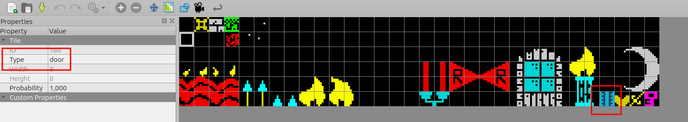

### Key

Como habrás podido ver en el párrafo anterior, necesitas el objeto **key** para abrir las puertas.

Para setear un tile de este tipo haz clic en la rueda dentada de propiedades del tileset, selecciona el tile que desees y escribe **key** en la casilla type.

Después ya puedes añadirlo a tu mapa arrastrándolo.

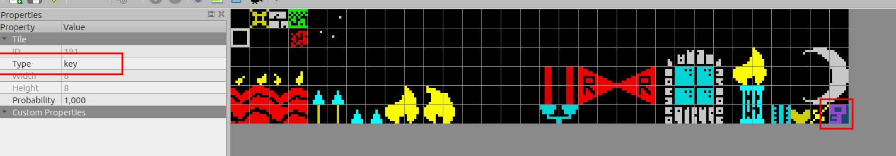

### Life item

Este objeto permitirá al personaje restablecer una cantidad de visa (configurable).

Para setear un tile de este tipo haz clic en la rueda dentada de propiedades del tileset, selecciona el tile que desees y escribe **life** en la casilla type.

Después ya puedes añadirlo a tu mapa arrastrándolo.

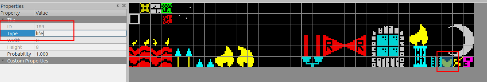

## Configuración general

Puedes añadir configuraciones generales de tu juego en las propiedades personalizadas el mapa.

Propiedades personalizadas:

* **damageAmount**. Cuanto daño le hacen al personaje los enemigos.
* **goalItems**. Número de items necesarios para finalizar el juego.
* **initialLife**. Cantidad de vida inicial del personaje.
* **lifeAmount**. Cantidad de vide que incrementa al personaje los items **life**

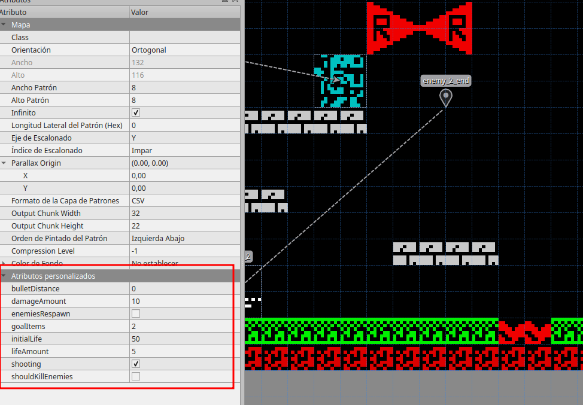