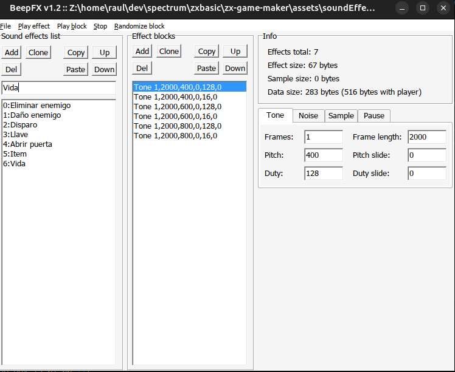
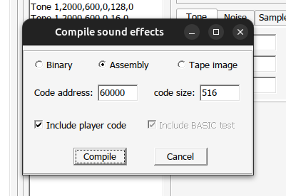

# Efectos de sonido

Para personalizar los efectos de sonido debes utilizar la aplicación de [shiru8bit](http://shiru.untergrund.net) BeepFX (http://shiru.untergrund.net/files/beepfx.zip)

ZX Game Maker necesita que definas 7 sonidos. Se reproducirán cuando en el juego sucedan cualquiera de las siguiente acciones:

* **Eliminar enemigo**
* **Daño enemigo**. Cuando la bala golpea al enemigo pero no le mata.
* **Disparo**
* **Llave**. Cuando el personaje recoge una llave.
* **Abrir puerta**
* **Item**. Cuando el personaje recoge un item.
* **Vida**. Cuando el personaje recoge un elemento que le recupera vida.

# Exportar para ZX Game Maker

Para exportar tus efectos de sonido para el ZX Spectrum Game Maker, sólo tendrás que ir al menu File > Compile. Seleccionar **Assembly** e **Include player code**, pulsar **Compile** y guardar el archivo en tu carpeta **assets** con el nombre **soundEffects.asm**

Solo con esto, al volver a ejecutar el generador de juego (make-game), ya se aplicarán tu sonidos.

Si esto lo ves complicado y quieres dejarlo para más adelante, ya tienes unos sonidos predeterminados.

**Si decides usar estos sonidos predeterminados, es muy importante que en tu juego pongas la atribución al autor que es [shiru8bit](http://shiru.untergrund.net)**